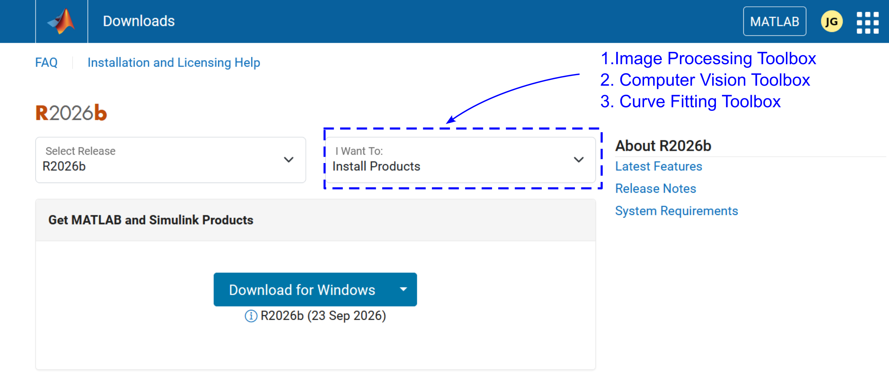

# Some preliminary information

## Why MATLAB ??
### A little background
For this hands-on training session on MATLAB, we will be using MATLAB to perform some simple image-processing exercises. However, image processing is quite broad and it can be in various ways. A go to alternative for MATLAB is python where you can use the ```opencv``` library to perform the same things.

For industry led projects or other endeavours, if you are need of high performance computing, then it is also possible to do image processing in ```c++```. Similarly, there are different easy-to-use sodtwares are present, which are primarily based on some form of interactive GUIs such as [ImageJ](https://imagej.net/ij/).


### Our approach
We will be using image-processing as a tool to understand the nuanced physics of fluid dynamics and soft matter. Hence, our approach will be strictly utilitarian. Other approaches of studying image processing can be highly mathematical or algorithimic etc.

According to my experience till date, MATLAB gives you the right balance of having GUI based apps to get you started quickly with the basics and later on, when faced with actual problems in fluid & soft matter, you can develop excellent routines using the matlab scripting language.


## How to install?

### First time installation
Keep in mind the following things while installing MATLAB -
* Installing MATLAB should be fairly straight forward if you have not done it already. You can download the installer from the [official website](https://www.mathworks.com/products/matlab.html)
once you use your university sign-in.

* After you finish signing in, you should see a ```install matlab``` button 


* Clicking on it should lead you to the following page



* To follow along the session, we will need to installed the three toolboxes shown above. You can choose any release of matlab that you like. I prefer to use a single release for my work so that I don't create some issues later on.

* Once you installed everything (keep calm and have a cup of tea , it takes a bit of time), you can use ```ver``` command in the ```command window``` in matlab to see everything is installed or not. 

Here is a truncated output of the ```ver``` command from my system. You should see something similar.
```matlab
>>ver
-----------------------------------------------------------------------------------------------------
MATLAB Version: xx.x.x.xxxxxxx (R2024b) Update 6
MATLAB License Number: xxxxxxxx
Operating System: Microsoft Windows 11

-----------------------------------------------------------------------------------------------------
MATLAB                                                Version 24.2        (R2024b)
Computer Vision Toolbox                               Version 24.2        (R2024b)
Curve Fitting Toolbox                                 Version 24.2        (R2024b)
Image Processing Toolbox                              Version 24.2        (R2024b)
```


### Not first time installation
* If you have already installed matlab in your system, then you only need to check if you have the above toolboxes. Type ```ver``` to see if you can find them.

* If not, then try to find an option called ```add-ons```, from where you will get to the 
. 

From here you should be able to ```add``` the above three toolboxes.
