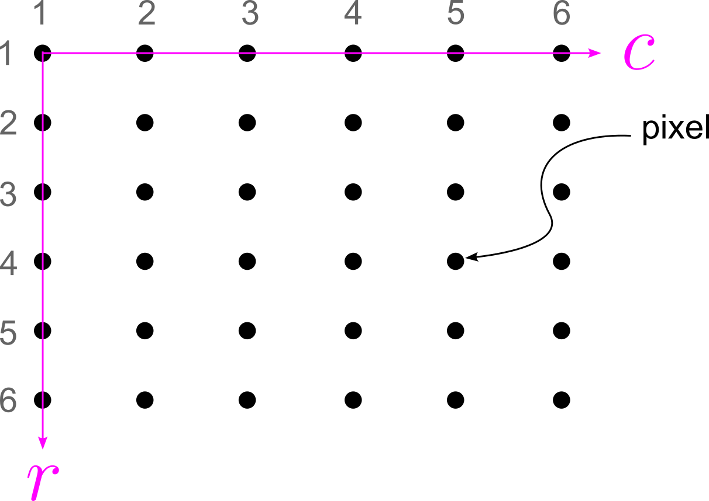

# About Images
Images are everywhere these days. In this script, we look at images from a different view-point than we used to.

## Mathematics of Images
On a bright/sunny sunday, I went to the Peak district. Here is an image I tool (just showing off !!)

  

### What do you see in this image?
- The poet in me will probably remember the following lines -

<blockquote align="center">
  

    Two roads diverged in a wood, and I— 
    I took the one less traveled by, 
    And that has made all the difference.
  

  <footer>
    — Robert Frost,
    <a href="https://www.poetryfoundation.org/poems/44272/the-road-not-taken">
      <em>The Road Not Taken</em>
    </a>
  </footer>
</blockquote>
 
- The nature lover in me will probably feel at awe or feel small.
 
- But but but !!!! As someone thinking about physics or mathematics will see a matrix or a function.

### Defining an Image
- An image can be defined as a two-dimensional function $f(x,y)$, where $x$ and $y$ are spatial plane coordinates.

- The amplitude $f$ at any pair $(x,y)$ is called **intensity** of the image at that point.

- A matrix of size $n \times m$ will look like a grayscale image. Here is the grayscale version of the image at the top. These are often called the monochromatic images (only a single 2D matrix)

  

 

- Color images are nothing but stacking 3 different 2D images. Each of these three $2D$ matrices will be called the color pannels. For example, a RGB image (a typical format) has three color pannels (or three different 2D matrices).

### Coordinate convention in MATLAB
Images are represented as a matrix in MATLAB. Following is the convention used -

  

Key points are -
- The origin of the image is at (1,1) and not (0,0)
- If (x,y) is the pixel coordinate of an image, then the first coordinate denotes row ($r$) and the second denotes columns ($c$)
- This is very **important** while writing for loops later on in MATLAB.